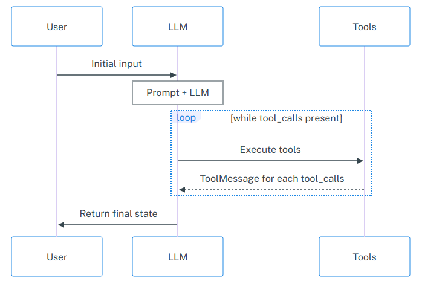

# AI Agent Example 

## AI Agents
By themselves, large language models (LLMs) can't take actions — they just output text. Agents are systems that take a high-level task and use an LLM as a reasoning engine to decide what actions to take and execute those actions. After executing actions, the results can be fed back into the LLM to determine whether more actions are needed, or whether it is okay to finish.

## AI Agent Example
In this example, an agent can have conversations with its users (humans or other agents). It can provide up-to-date information about the present that the LLM does not possess because it was not trained on it.

The agent:
 - Interacts with a search engine (an external tool) to answer users' questions. The engine is called [Tavily](https://www.tavily.com/) and provides a web search API that enables real-time information retrieval from the internet. It's useful for grounding LLMs with fresh, factual, and search-based answers.
 - Has conversational memory — meaning that it can be used as a multi-turn chatbot. The agent remembers past interactions across multiple turns of a conversation which in turn enables context-aware decision-making and more natural, coherent dialogue over time.

## Agentic Workflow
Here is an AI Agent sequence diagram:

 

 Source: [LangGraph](https://langchain-ai.github.io/langgraph/reference/agents/#langgraph.prebuilt.chat_agent_executor.create_react_agent)

 This example uses the [LangChain](https://python.langchain.com/) LLM framework, but there are others — such as OpenAI's tools or CrewAI — that can provide a similar experience.
